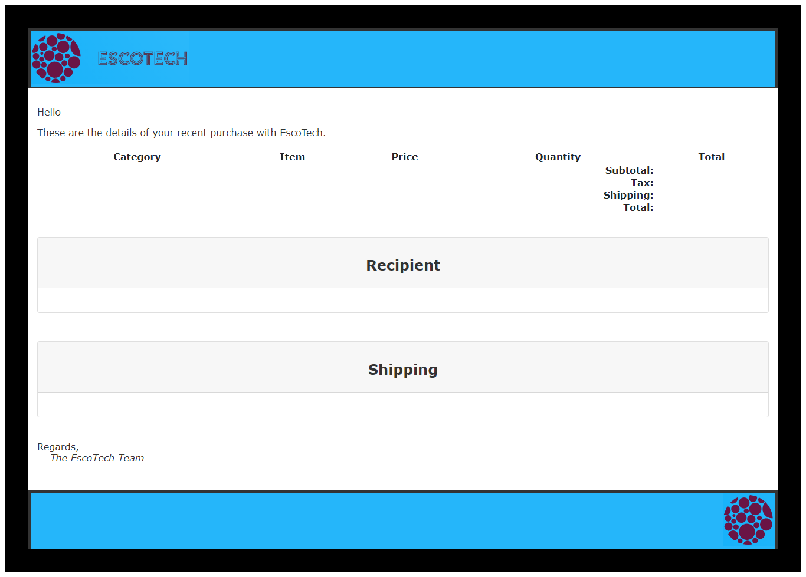

# EscoTech
EscoTech is a fictitious online shop that specializes in the creation and repair of time machines.
EscoTech admins login via AWS Cognito and can perform CRUD operations on products and orders.
Purchases are made with paypal via calls to their REST API.   Once a purchase is complete, a receipt is emailed to the purchaser via gmail smtp.

- Hosted on AWS: https://goviesco.com (paypal is in sandbox mode, so you will not be able to login)
- Demo (if site is not hosted or to see admin use cases that are inaccessible without login info): https://www.youtube.com/watch?v=GFSmuP0th0Q&list=PLdK_FPPkkRWmCwHKLnNEv6tFWcbF701rQ
## Intallation
To get this app running requires the creation and configuration of the following accounts: paypal developer, gmail, and AWS. The setup for each would require the writing of an article in itself. As an alternative, I will leave the app hosted on AWS as long as possible and provide a video that demos the app on youtube.
## Technology
This is a spring boot app that uses the MVC architecture, makes REST calls to PayPal, and emails a receipt.
Please see the [pom.xml](pom.xml) file for a complete list of dependencies.
- Java 11
- Spring Boot
- Spring Web MVC
- PostgreSQL 12
- Spring Data JPA
- Spring Security
- Thymeleaf [files](src/main/webapp/WEB-INF/views/)
- CSS [files](src/main/resources/static/css/)
- JavaScript [site.js](src/main/resources/static/js/site.js)
- BootStrap
- AWS  Cognito (i.e. for admin authentication and authorization)
- Junit5
## Some Advanced Features
### Data Processing
It uses Optionals, Streams (e.g., map, reduce, and filter), Collectors and Lambda functions for data processing. These are some classes demonstrating these techniques:
- [Cart.java](src/main/java/com/escotech/dto/Cart.java)
- [OrderController.java](src/main/java/com/escotech/controller/OrderController.java)
- [ShoppingController.java](src/main/java/com/escotech/controller/ShoppingController.java)
- [CategoryConverter.java](src/main/java/com/escotech/enums/CategoryConverter.java)
- [OrderService.java](src/main/java/com/escotech/service/OrderService.java)
### Image Processing
Product images are resized and compressed via [ImageProcessor.java](src/main/java/com/escotech/service/ImageProcessor.java).
### Entities
Entities use validation constraints to mitigate user input errors, as well as [Lombok annotations](https://projectlombok.org/) to reduce code.
[Order.java](src/main/java/com/escotech/entity/Order.java) and [Product.java](src/main/java/com/escotech/entity/Product.java) both use the @OneToMany annotations to establish relationships with [OrderLine.java](src/main/java/com/escotech/entity/OrderLine.java) and [Image.java](src/main/java/com/escotech/entity/Image.java), respectively.
[Order.java](src/main/java/com/escotech/entity/Order.java) uses @Transient to reduce memory storage in the database and @PostLoad to calculate those values after an order is retrieved from the database.
### [MapStruct](https://mapstruct.org/)
[MapStructMapper.java](src/main/java/com/escotech/service/MapStructMapper.java) is used for mapping entities and DTOs.
### Cart
@SessionAttributes is used to store model attributes in the HTTP Servlet session between requests. It is a type-level annotation that declares the session attributes used by a specific controller.
This typically lists the names of model attributes or types of model attributes that should be  transparently stored in the session for subsequent requests to access. These controllers demonstrate its usage:
- [ShoppingController.java](src/main/java/com/escotech/controller/ShoppingController.java)
- [CheckoutController.java](src/main/java/com/escotech/controller/CheckoutController.java)
- [ShippingController.java](src/main/java/com/escotech/controller/ShippingController.java)
### Email Receipt
A thymeleaf template is used to compose an editable email: [email-editable](src/main/resources/mail/editablehtml/email-editable.html). The CSS is written inline for the email template; most email providers support it, so it will be less likely to have any formatting issues. Once an order is complete, the [Order](src/main/java/com/escotech/entity/Order.java) object is passed to the [EmailService](src/main/java/com/escotech/service/EmailService.java) where the order data is passed to the editable email template. The email is sent via gmail smtp.

In order to send an email after the app is deployed, two step verification must be enabled (if it is not enabled and you attempt to use *less secure apps* gmail may not allow the app to sign in). Your gmail user name and the app password must be added to the [application.properties](src/main/resources/application.properties) file.
To get an app password complete these steps:
1. Go to https://security.google.com/settings/security/apppasswords and sign in to your account.
2. Select Mail from the list of apps available.
3. Select Other from the device list.
4. Enter the app name: EscoTech.
5. Click the Generate button.
6. Copy and save the password to your computer.
7. Click the Done button.
### Frontend
The [frontend](src/main/webapp/WEB-INF/views/) is responsive, so it looks different on mobile, tablets, and computers. It is also screen reader friendly (e.g., it contains skip lists and headers are properly labeled)
